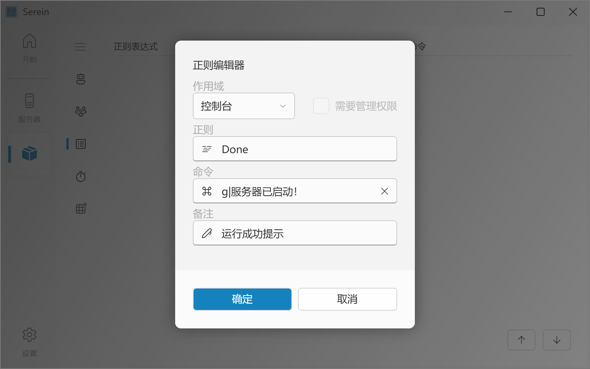

正则数据保存在*data/regex.json*

> [!TIP]
>
>- 将他人的记录复制在该文件中以合并添加他人的正则
>- 直接将此文件分享给其他人供他人使用
>- 将数据文件拖入窗口覆盖导入正则，但是要注意**此操作不可逆**

### 食用方法

在正则表格中右键打开菜单，在弹出的对话框中输入相应文本修改或创建正则记录
  
>[!WARNING]正则表达式或命令为空或不合法时无法保存

### 功能介绍

#### 作用域

指定匹配的区域，可为以下五个值

- 禁用 *不做任何匹配*
- 控制台 *匹配控制台*
- 消息（群聊） *匹配群聊消息*
- 消息（私聊） *匹配私聊消息*
- 消息（自身发送） *匹配自身上报消息*

>[!ATTENTION]
> 若选择*消息（自身发送）*，保存前请务必检查这条正则触发的命令是否会导致再次被所触发内容触发，配置错误可能导致机器人刷屏甚至被封号

#### 正则表达式

一种字符串匹配的模式，可以用来检查一个串是否含有某种子串、将匹配的子串替换或者从某个串中取出符合某个条件的子串等。

> [!TIP]
> **基础语法：**  
>[.NET 正则表达式  Microsoft Docs](https://docs.microsoft.com/zh-cn/dotnet/standard/base-types/regular-expressions)  
>[C# 正则表达式  菜鸟教程](https://www.runoob.com/csharp/csharp-regular-expressions.html)

| 高级功能                                                                                                                                                                                     | 可用性     |
| -------------------------------------------------------------------------------------------------------------------------------------------------------------------------------------------- | ---------- |
| [替换已编号的组](https://docs.microsoft.com/zh-cn/dotnet/standard/base-types/substitutions-in-regular-expressions#substituting-a-numbered-group) （`$1` `$114514`）                      | 可用       |
| [条件匹配的表达式](https://docs.microsoft.com/zh-cn/dotnet/standard/base-types/alternation-constructs-in-regular-expressions#conditional-matching-with-an-expression)                        | 理论可用   |
| [基于有效的捕获组的条件匹配](https://docs.microsoft.com/zh-cn/dotnet/standard/base-types/alternation-constructs-in-regular-expressions#conditional-matching-based-on-a-valid-captured-group) | 理论可用   |
| [替换命名组](https://docs.microsoft.com/zh-cn/dotnet/standard/base-types/substitutions-in-regular-expressions#substituting-a-named-group)                                                    | *暂不可用* |
| [替换整个匹配项](https://docs.microsoft.com/zh-cn/dotnet/standard/base-types/substitutions-in-regular-expressions#substituting-the-entire-match)                                             | *暂不可用* |
| [替换匹配项前的文本](https://docs.microsoft.com/zh-cn/dotnet/standard/base-types/substitutions-in-regular-expressions#substituting-the-entire-match)                                         | *暂不可用* |
| [替换匹配项后的文本](https://docs.microsoft.com/zh-cn/dotnet/standard/base-types/substitutions-in-regular-expressions#substituting-the-text-after-the-match)                                 | *暂不可用* |
| [替换最后捕获的组](https://docs.microsoft.com/zh-cn/dotnet/standard/base-types/substitutions-in-regular-expressions#substituting-the-last-captured-group)                                    | *暂不可用* |
| [替换整个输入字符串](https://docs.microsoft.com/zh-cn/dotnet/standard/base-types/substitutions-in-regular-expressions#substituting-the-entire-input-string)                                  | *暂不可用* |

>[!WARNING]
>由于功能限制，若无特别标记，正则表达式仅**匹配第一个符合条件的文本**  
>例：`(.+?)`匹配*我是一段文本*仅返回第一个字*我*（即使使用贪婪模式也是如此）  
>*解决方法：强制匹配整段文本`(.+?)`→`^(.+?)$`*

#### 需要管理权限

主要针对群聊消息和私聊消息，触发时会检验用户是否拥有管理权限

#### 执行命令

执行一条[Serein命令](../Command.md)，你可以在其中插入[变量](../Variables.md)

#### 备注

对这项内容的备注或注释，不影响匹配

### 文件格式

```json
{
  "type": "REGEX",
  "comment": "非必要请不要直接修改文件，语法错误可能导致数据丢失",
  "data": [
    {
      "Regex": "^(.+?)$",  // 正则表达式
      "Remark": "",  // 备注
      "Command": "",  // 执行命令
      "Area": 0,  // 作用域
      "IsAdmin": false  // 需要管理权限 
    }
  ]
}
```
