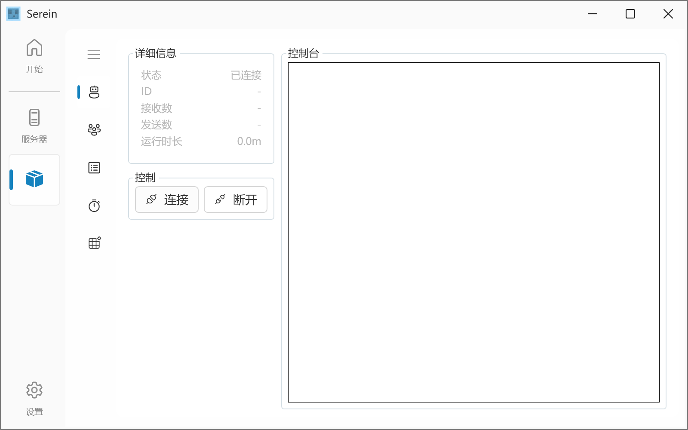

## 机器人

### 支持的条件

- 使用[OneBot-11](https://github.com/botuniverse/onebot-11)标准
  - 使用新[OneBot-12](https://12.onebot.dev/)标准的机器人不确定是否可用，可自行尝试
- 可使用WS正向连接

> **⚠ 提示**  
>
>- 由于不同机器人之间标准可能存在差异，不一定保证100%适配所有机器人
>- 目前已完全支持的机器人：[`go-cqhttp`](https://github.com/Mrs4s/go-cqhttp)、[`OneBot Mirai`](https://github.com/yyuueexxiinngg/onebot-kotlin)  
>- **此处列举的机器人只代表已经经过测试且可用，并不是只有以上两种机器人可用**

### 配置方法（以go-cqhttp为例）

1. 下载并运行，首次运行时会释放启动文件和配置文件
2. 再次运行，当出现提示选择通信方式时，选择`正向 Websocket 通信`
3. 在配置文件中填入账号和密码
4. 再次运行go-cqhttp以登录帐号
5. 在`设置`>`机器人`>`Websocket地址`中设置与机器人配置文件中一致的地址
6. 单击`机器人`>`连接`按钮连接机器人

> **⚠ 提示**  
>其他机器人可能需要直接修改配置文件，但操作方法类似

### 鉴权

鉴权（authentication）是指验证用户是否拥有访问系统的权利。

在机器人的配置文件中设置`Access-Token`字段，可用防止ws服务器运行在公网时被任意客户端连接

此外，你还需要将`Access-Token`内容复制到`Serein`的`设置`>`机器人`>`鉴权凭证`，用于连接时鉴权  

> **⚠ 提示**  
>`Access-Token`区分大小写、首尾空格等
